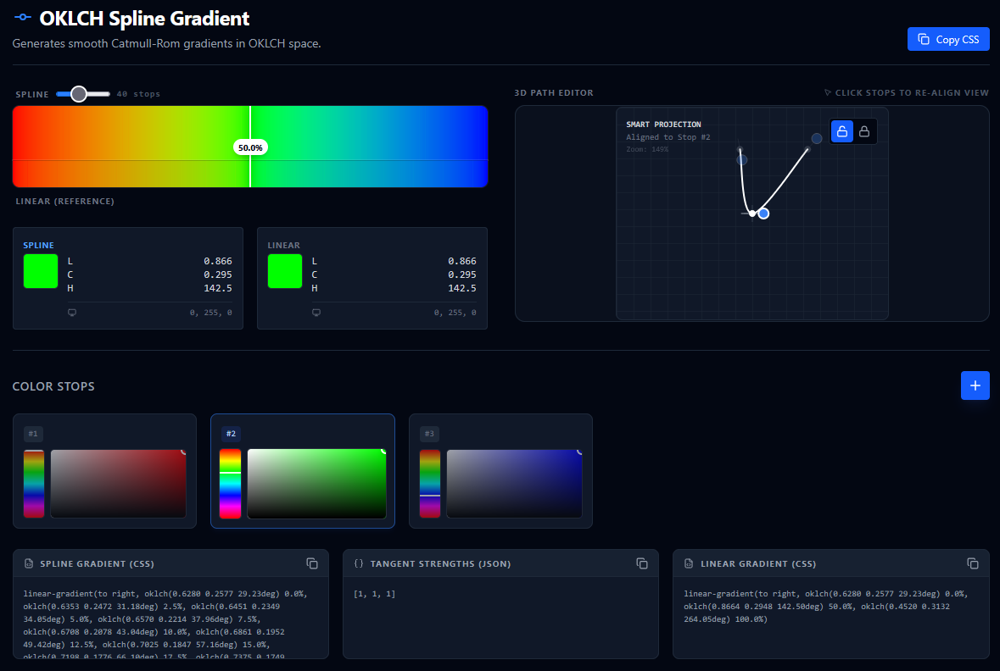

# Better OKLCH/OKLAB Spline Gradients

This project provides a standalone JavaScript implementation and a web-based visualization tool for generating **perceptually smooth, high-order color gradients**.

By utilizing **Cubic Hermite Splines (Catmull-Rom)** and **Natural Cubic Splines** within the **OKLAB/OKLCH** color space, this approach mitigates common artifacts found in standard linear sRGB interpolation, such as Mach bands and desaturated intermediate colors.

[](https://zral0kh.github.io/hermite-oklch-gpage/)

[**🚀 Open Live Editor**](https://zral0kh.github.io/hermite-oklch-gpage/)

---

## 1. Limitations of Standard Linear Gradients

Standard CSS gradients (`linear-gradient`) typically rely on **Linear Interpolation (Lerp)** within the **sRGB** color space. While computationally efficient, this method introduces three significant perceptual flaws:

### A. The "Gray Dead Zone"
When interpolating between complementary colors (e.g., Blue to Yellow), a linear path through the RGB cube often intersects the achromatic (gray) axis.
*   **Consequence:** Vibrant input colors result in a desaturated, "muddy" transition in the middle of the gradient.

### B. Mach Banding
Standard multi-stop gradients function as polylines ($C^0$ continuity). At each color stop, the rate of change (velocity) of the color shifts instantaneously.
*   **Consequence:** The human visual system is highly sensitive to discontinuities in the first derivative. These abrupt changes in slope are perceived as physical lines or bands, known as **Mach Bands**, even when the color values are continuous.

### C. Perceptual Non-Uniformity
The sRGB color space is not perceptually uniform. A Euclidean distance of $X$ in the Green channel represents a significantly different visual magnitude than the same distance in the Blue channel.
*   **Consequence:** Gradients appear to accelerate and decelerate unevenly, creating an unbalanced visual rhythm.

---

## 2. Methodology

This tool addresses these limitations by combining a perceptually uniform color space (OkLab / OKLCH) with higher-order interpolation logic.


### The Path: Cubic Splines
Instead of connecting stops with straight lines, we fit either a  **Catmull-Rom Spline** ( Centripetal or Chordal) or a **Natural Cubic Spline** through the control points.

1.  **$C^1$ Continuity:** The spline ensures that the incoming velocity vector at a stop matches the outgoing velocity vector.
    *   *Result:* Smooth tangents eliminate sharp derivative changes, preventing Mach banding artifacts.
2. **Curve Parametrization:** We support both uniform and geometric chords (segments) for the spline. Normally one expects the given control points to be seperated in the gradient by equal amount. This is what uniform does. Geometric basically means we auto adjust the location of the control points to reflect the distances in color space with respect to the . For Natural Cubic Splines this has not effect.

> **Note on Optimization:** While the Cubic Hermite Spline is not a global energy minimization curve (Euler-Bernoulli elastica), it is still quite effective at producing visuall smooth transitions with minimal computational overhead. If you need true optimization you can opt for the Natural Cubic Spline instead.
### The additional Space: OKLCH
Calculations can be performed in **Oklch** (Oklab Cylindrical). By separating Lightness and Chroma from Hue, we can interpolate rotationally.

This means the spline path naturally curves around the achromatic center rather than cutting through it.
    *   *Result:* Saturation is preserved. For example, a Blue-to-Yellow gradient follows an arc through valid chromatic space, producing a vibrant intermediate tone rather than gray.

---

## 3. The Visual Editor

The idea is that the user can manipulate the spline curve by changing strength, and orientation of the tangents at each stop. (In practice you only need strength as a change in orientation is equal to a different set of fixpoints.)
While Colors with alpha Values are supported, the editor only supports 3D coordinates and we externalize the editing of alpha values to a simple 2D curve.

Editing 3D coordinates on a 2D screen is difficult, so we don't do that. We instead utilize specific projection planes and interaction modes to make the process intuitive. 

*   **Neighbor Plane Projection:** When a stop is selected, the viewport automatically aligns to the local curvature plane defined by the active point and its neighbors. This ensures edits are made in the most relevant geometric context. Note that this is not the Frenet-Frame because it is unstable for curves with points of zero curvature. In practice that should not be a problem for your edits. It is however close to it.
*   **Orthogonal Plane Projection:** In rotation mode, the tangent vector is manipulated within the plane orthogonal to its current direction, allowing intuitive rotational adjustments.
  
*   **Adaptive Scaling:** The editor uses an $L_2$ norm scaling factor to ensure the visualization remains stable and usable regardless of the curve's rotation in 3D space.

### Tangent Control Modes
*  **Strength Mode:** Constrains manipulation to the magnitude only. This allows for adjusting the "tension" of the curve—tightening or loosening the transition—without altering the hue trajectory.
*  **Free Mode:** Allows manipulation of the tangent vector freely in the projected plane, enabling custom directional adjustments to the curve's path.
*  **Rotation Mode:**  Dragging the vector in this mode, initially a point, rotates it around the half ball of tangent length in the original tangent direction.


---

## 4. Usage in Production

Native browser support for spline-based interpolation is currently unavailable. To utilize these gradients in production, the curve is sampled at discrete intervals (e.g., 20 steps) to generate a standard CSS `linear-gradient` string.

```css
/* Output is a high-resolution linear approximation */
background: linear-gradient(to right, 
  oklch(0.6 0.15 240 / 100) 0%, 
  oklch(0.62 0.16 235 / 98) 2.5%,
  /* ... intermediate samples ... */
  oklch(0.8 0.1 100 / 54) 100%
);
```

## 5. Standalone Library

The repository includes a standalone JavaScript module (`hermite_oklch_gradients.js`) for programmatic generation.

**Note:** The standalone library supports configuring tangent **strengths** (lengths in the visual editor) (==tension) but does not allow for arbitrary 4D direction vectors. In practice, desired path alterations are best achieved by inserting intermediate color stops or changing existing ones rather than manually manipulating 4D tangent vectors. 
    Reverse engineering those from the manipulated vectors is hard so we don't do that.
    If you really need that you need to finetune with the visual editor anyways, so you can use its output.
